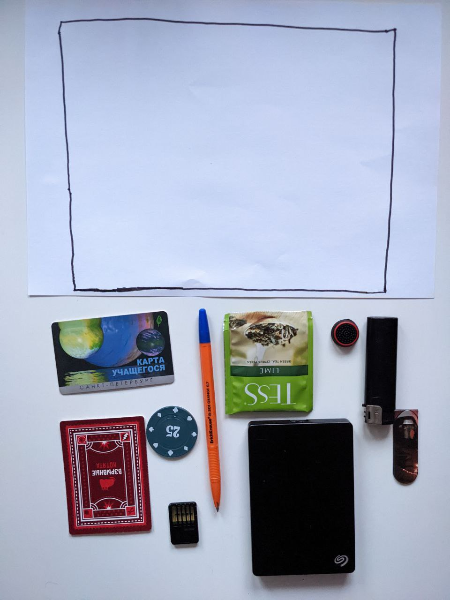
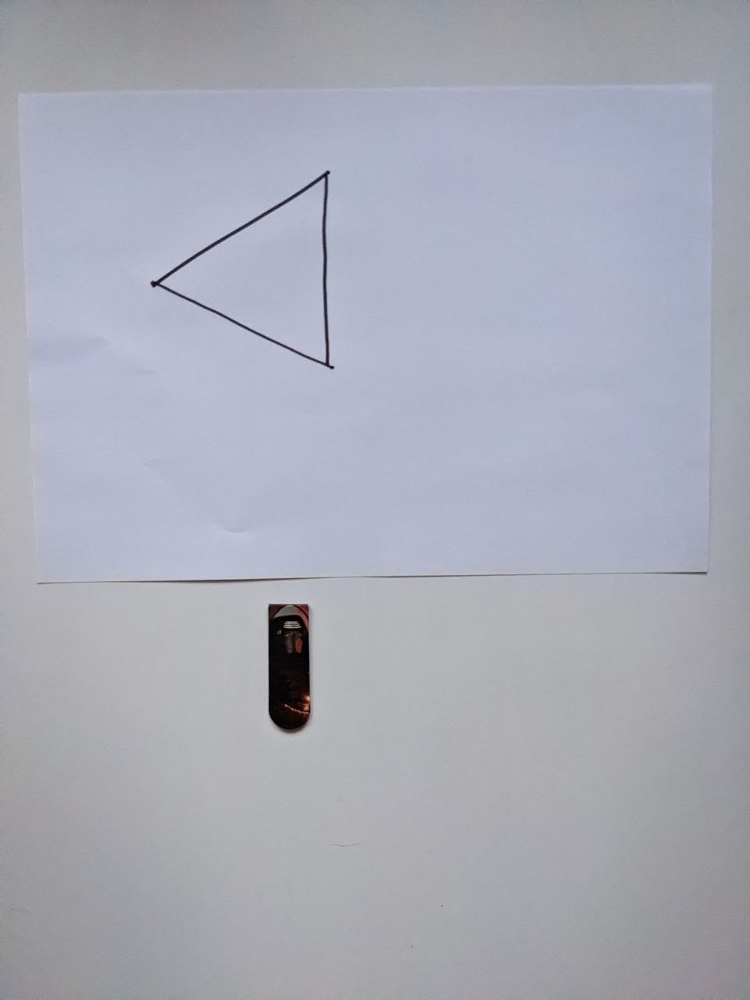
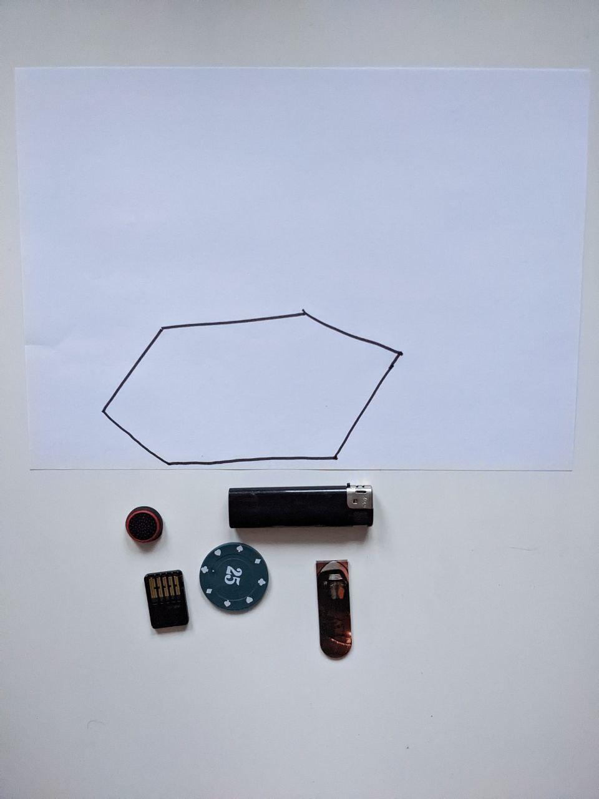
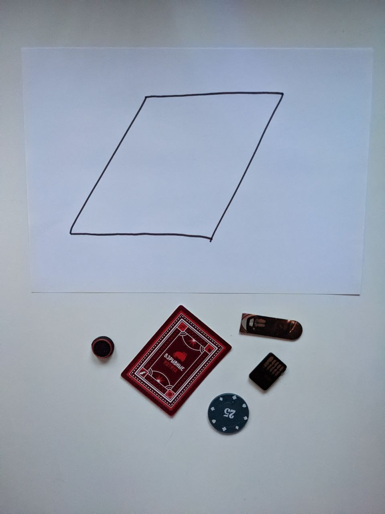
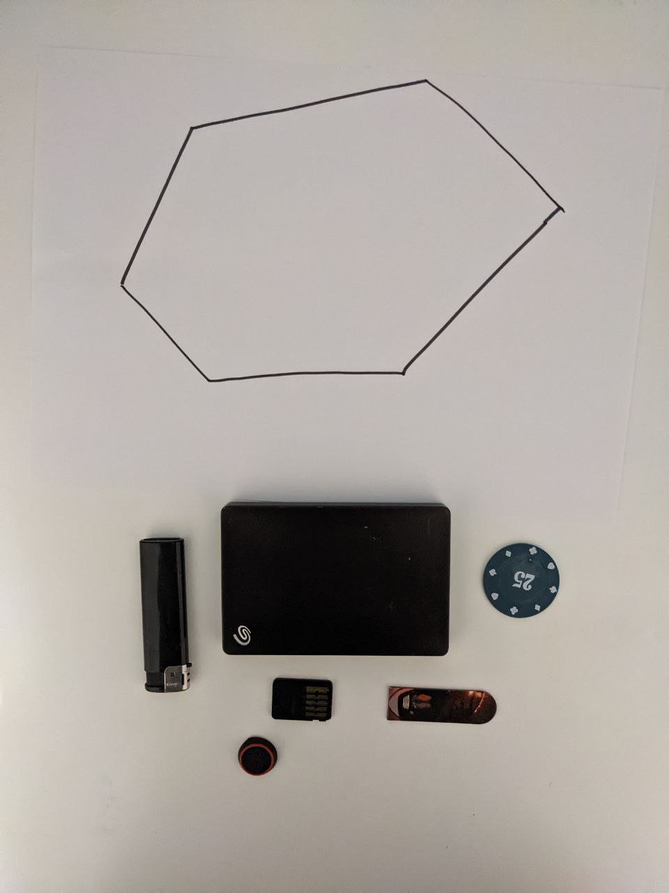
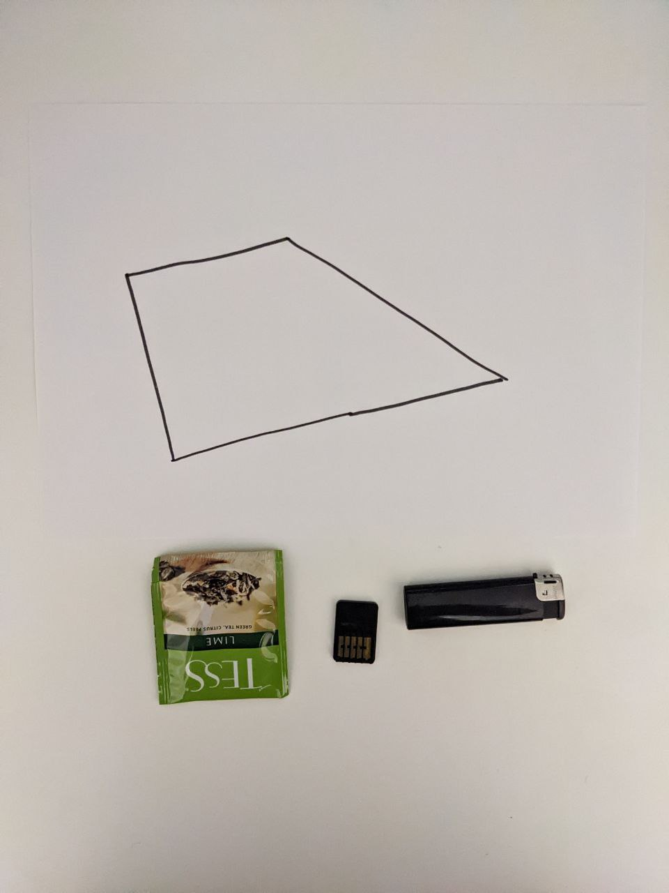

# Тестовые данные, выдающие true
1) Большой многоугольник и все предметы помещаются

2) Многоугольник поменьше, но предметы все ещё помещаются

3) Маленький предмет помещается в многоугольник

4) Маленький многоугольник, но все предметы помещаются

5) Все предметы помещаются

6) Все предметы помещаются

7) Все предметы помещаются

