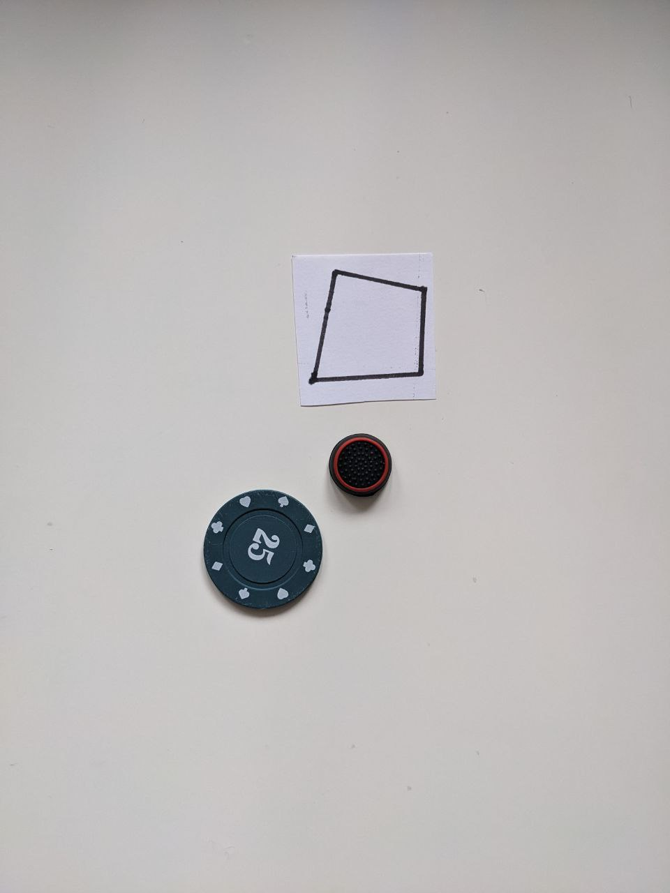
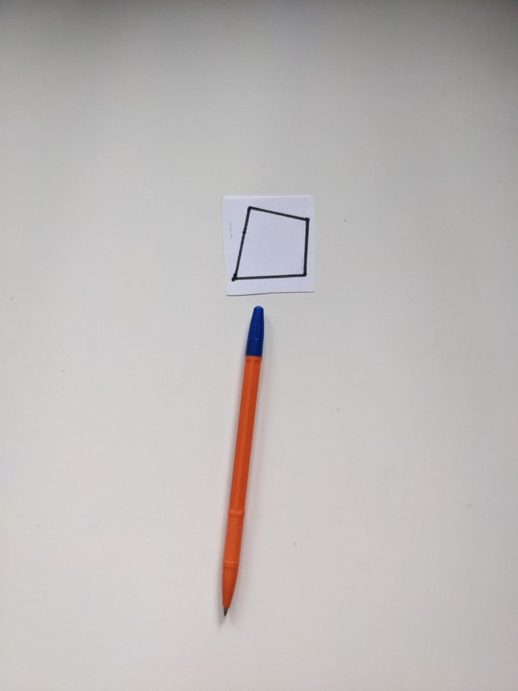
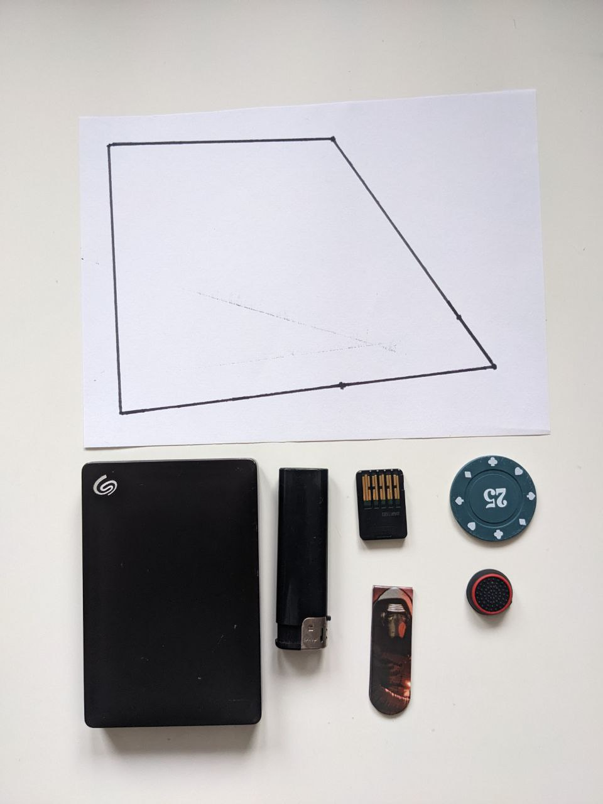
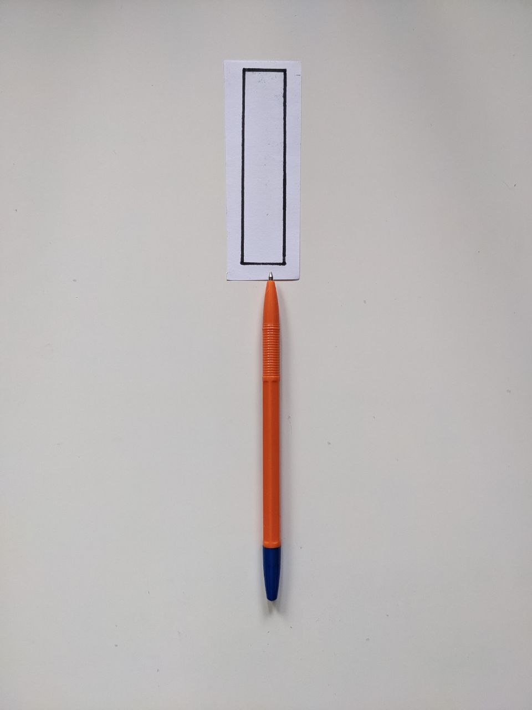

# Тестовые данные, выдающие false
1) Нет многоугольника

2) Маленький предмет не помещается в многоугольник

3) Предмет пересекает многоугольник

4) Предметы пересекаются

5) Невыпуклый многоугольник

6) Предмет не помещается в кадр

7) Один предмет поместился бы, другой нет, и вместе тоже нет

8) Предмет не помещается

9) По отдельности предметы помещаются, но вместе нет

10) Много предметов не помещаются

11) Предмет не помещается

12) Много предметов не помещаются
