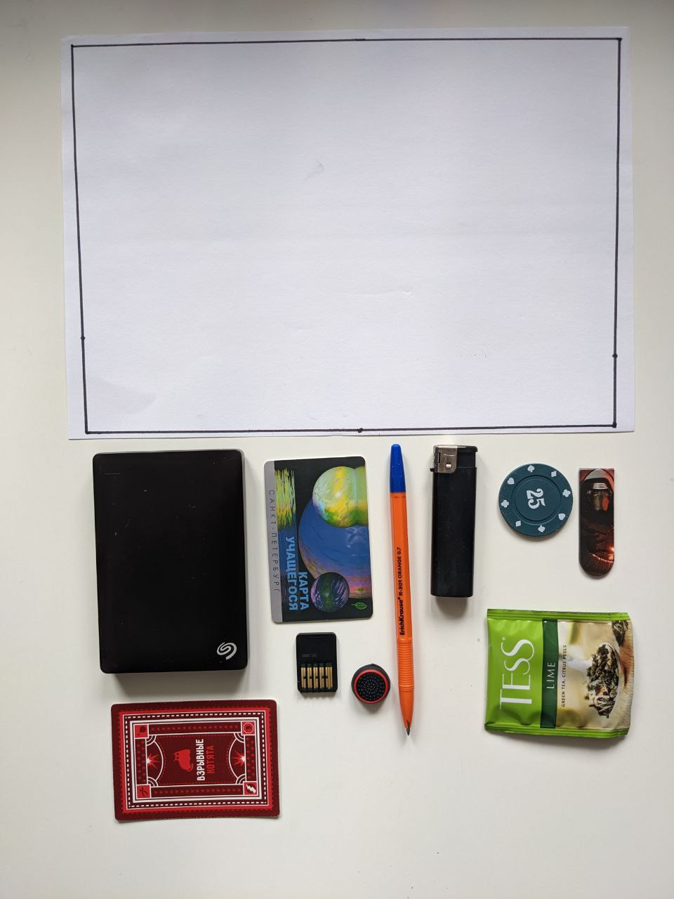
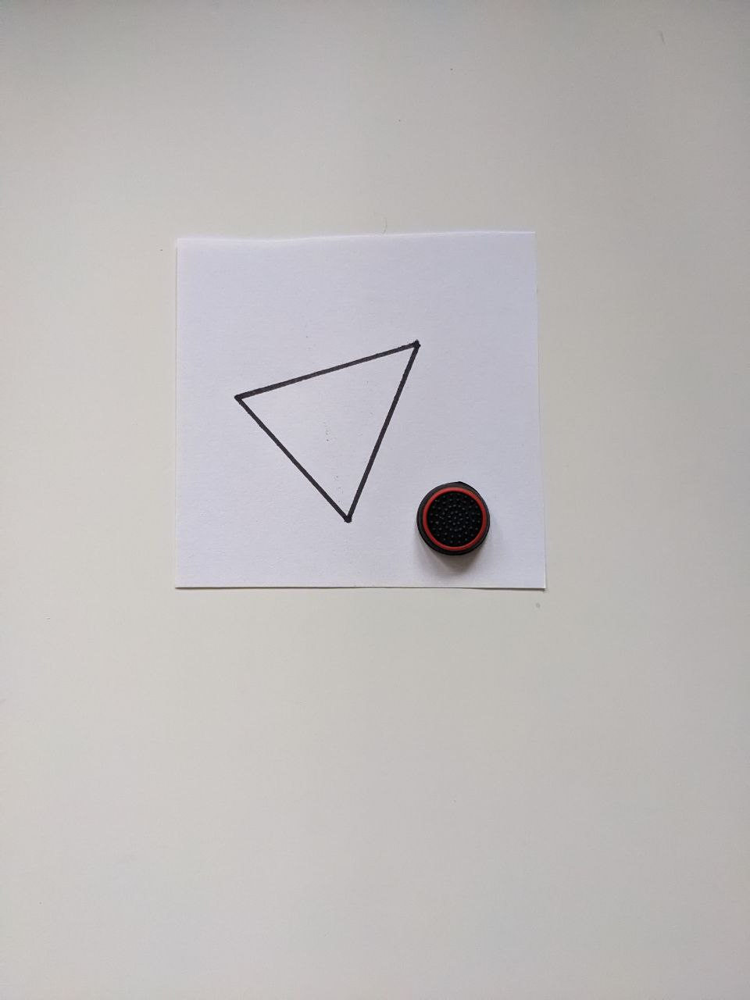

# Тестовые данные, выдающие true
1) Нет предметов вовсе, но есть прямоугольник

2) Большой многоугольник и все предметы помещаются

3) Многоугольник поменьше, но предметы все ещё помещаются

4) Маленький предмет помещается в многоугольник

5) Маленький многоугольник, но все предметы помещаются

6) Все предметы помещаются

7) Все предметы помещаются

8) Все предметы помещаются

